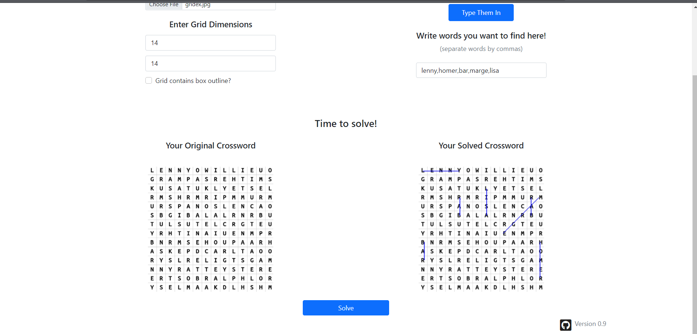

# Word-Searcher

#### Running Instructions
- Clone the repository
- Install dependencies in requirements.txt
- Run app.py in root of the repository

#### Current Issues
- *Unfortunately, downloading locally requires a cloud vision api key,which needs to be added to the modules folder as a json

#### Tech Used:
 - Flask backend, vanilla js frontend, opencv, Google OCR Api
#### Improvements
 ##### String Search
  - ~~Currently, a naive string search is used to find substrings in a 2d array. This can be sped up.~~ Improved word searching using tries for words to be searched.

 #### OCR 
  - Most critical part. 
  - Current iteration uses opecv preprocessing and Google OCR which takes a significant amount of time to process a 14x14 grid.
  - Other solutions that were attempted to detect letters were tesseract and a simple LeNet model with a training set 900 letters collected from various word-searches with different fonts. Initial iterations were scrapped due to poor performance.
 
 
 
